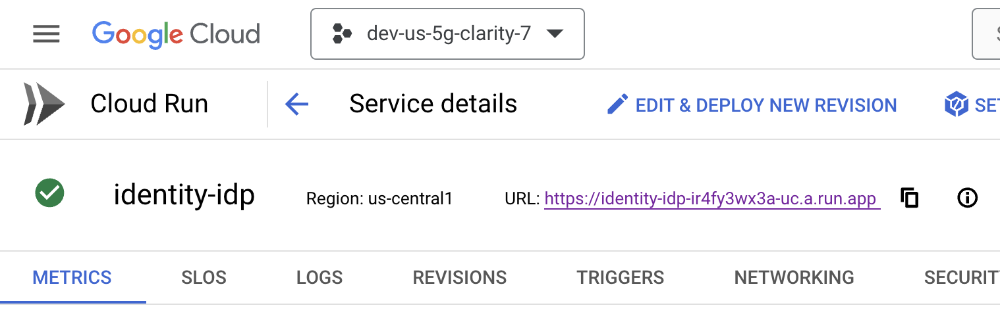
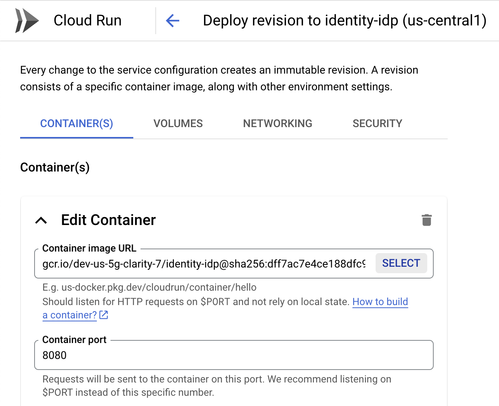
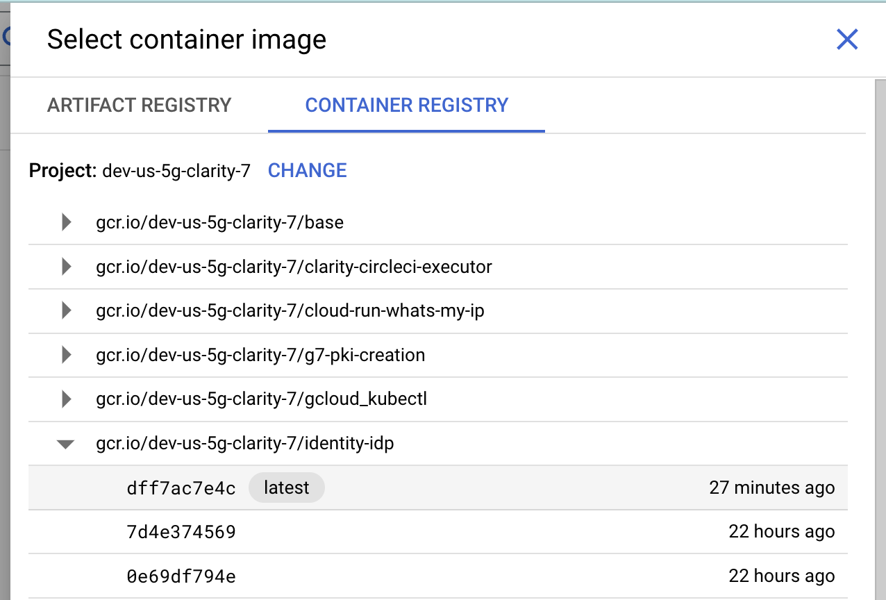
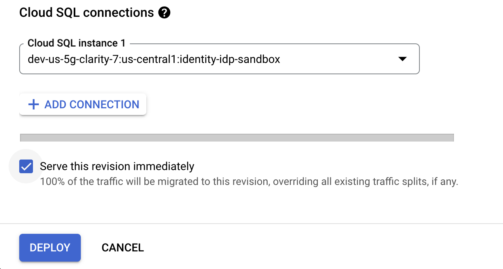
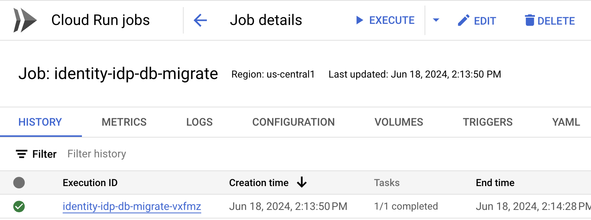
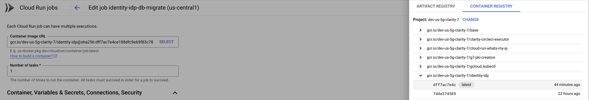
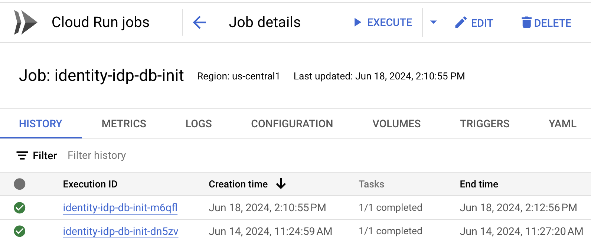
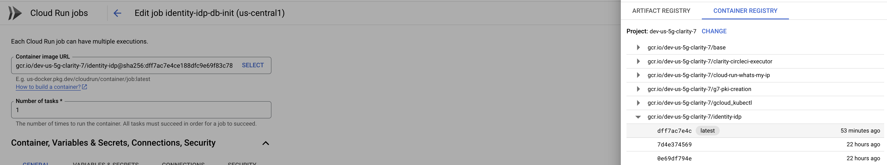

# Login.gov Identity Provider (IdP)

Login.gov is the public's one account for government. Use one account and password for secure, private access to participating government agencies.

This repository contains the core code base and documentation for the identity management system powering secure.login.gov.

**This file is auto-generated**. Run `make README.md` to regenerate its contents.

## Getting Started

Refer to the [_Local Development_ documentation](./docs/local-development.md) to learn how to set up your environment for local development.

## Guides

- [The Contributing Guide](CONTRIBUTING.md) includes basic guidelines around pull requests, commit messages, and the code review process.
- [The Login.gov Handbook](https://handbook.login.gov/) describes organizational practices, including process runbooks and team structures.

## Documentation

- [Back-end Architecture](docs/backend.md)
- [Front-end Architecture](docs/frontend.md)
- [Local Development](docs/local-development.md)
- [Mobile local development](docs/mobile.md)
- [Security](docs/SECURITY.md)
- [Troubleshooting Local Development](docs/troubleshooting.md)
- [Upgrade and A/B test Acuant SDK](docs/sdk-upgrade.md)

## Manual Build and Deploy

### <a id="step1"></a>Step 1: Build

#### Prerequisite: Authenticated gcloud cli tool

Submit a gcloud build from your local machine.

```sh
$> cd 18F-identity-idp

18F-identity-idp
$> gcloud builds submit --region=us-west2 --tag gcr.io/dev-us-5g-clarity-7/identity-idp .
```

View build progress at: https://console.cloud.google.com/cloud-build/builds;region=us-west2?project=dev-us-5g-clarity-7

### Step 2: Deploy

Deploy the new version from Google Cloud Console

- Go to the identity-idp cloud run service dashboard [here](https://console.cloud.google.com/run/detail/us-central1/identity-idp/metrics?project=dev-us-5g-clarity-7)

- Select "_EDIT & DEPLOY NEW REVISION_" 
- Edit the container image, and select new image built in [Step 1](#step1)  

- Make sure "_Serve this revision immediately_" is selected at the bottom
- Click "_Deploy_" 

### Run Database Migrations

The CloudRun Job [identity-idp-db-migrate](https://console.cloud.google.com/run/jobs/details/us-central1/identity-idp-db-migrate/executions?project=dev-us-5g-clarity-7) can be used to run database migrations.

#### To run migrations:

- Select "_EDIT_" 
- Edit the container image, and select new image build in [Step 1](#step1) 
- Make sure "_Execute job immediately_" is checked at the bottom
- Click "_UPDATE_" 

### Re-Create Database

If we need to clobber the postgres database and re-seed it, the CloudRun Job [identity-idp-db-init](https://console.cloud.google.com/run/jobs/details/us-central1/identity-idp-db-init/executions?project=dev-us-5g-clarity-7) can be used.

#### To re-create the database:

- Select "_EDIT_" 
- Edit the container image, and select new image build in [Step 1](#step1) 
- Make sure "_Execute job immediately_" is checked at the bottom
- Click "_UPDATE_" 
