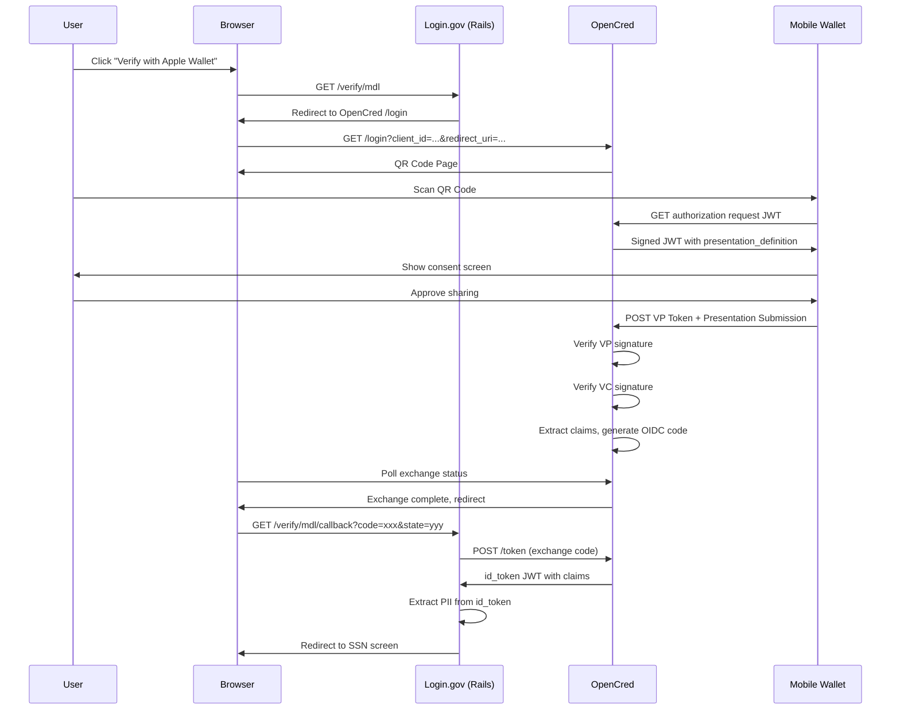
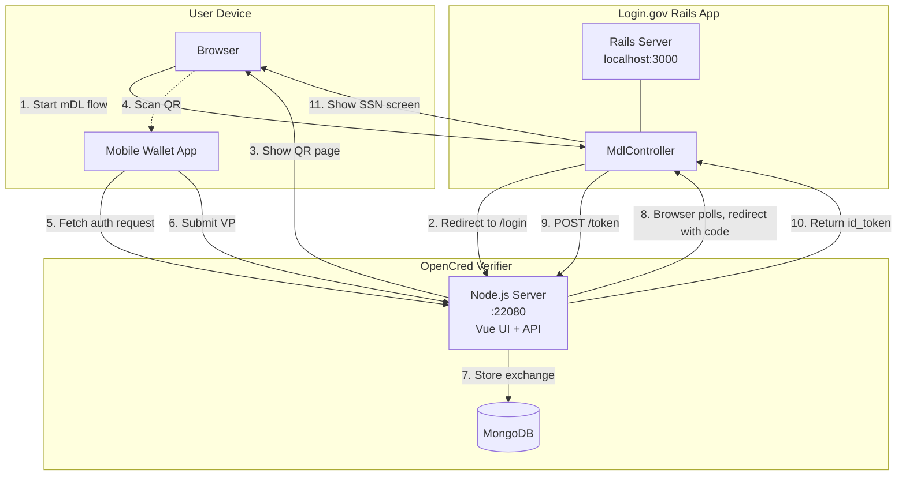
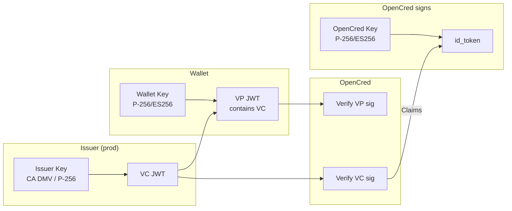

# mDL Data Flow

URLs below use `192.168.1.22:22080` for physical device testing. Use `localhost:22080` for browser-only. Controlled by `opencred_base_url` in application.yml.

## Flow



## Request/Response Data

### Rails -> OpenCred redirect

```
GET http://192.168.1.22:22080/login
  ?client_id=login-gov-mdl
  &redirect_uri=http://localhost:3000/verify/mdl/callback
  &response_type=code
  &scope=openid
  &state={random_csrf_token}
```

### QR code content (OID4VP)

```
openid4vp://?client_id=did:web:192.168.1.22:22080
            &request_uri=http://192.168.1.22:22080/workflows/login-gov-mdl-workflow
                         /exchanges/{exchange_id}/openid/client/authorization/request
```

### Auth request JWT (OpenCred -> Wallet)

```json
{
  "response_type": "vp_token",
  "response_mode": "direct_post",
  "client_id": "did:web:192.168.1.22:22080",
  "client_id_scheme": "did",
  "nonce": "{challenge}",
  "response_uri": "http://192.168.1.22:22080/workflows/.../authorization/response",
  "presentation_definition": {
    "id": "{uuid}",
    "input_descriptors": [{
      "id": "{uuid}",
      "constraints": {
        "fields": [{
          "path": ["$.vc.type", "$.type"],
          "filter": {"type": "string", "pattern": "VerifiableCredential"}
        }]
      },
      "format": {
        "jwt_vc_json": {"alg": ["ES256"]}
      }
    }]
  },
  "client_metadata": {
    "client_name": "OpenCred Verifier",
    "vp_formats": {
      "jwt_vp_json": {"alg": ["ES256"]}
    }
  }
}
```

### Wallet response

```
POST /workflows/.../authorization/response
Content-Type: application/x-www-form-urlencoded

vp_token={signed_jwt}&presentation_submission={json}
```

VP Token payload:
```json
{
  "iss": "did:jwk:{wallet_public_key}",
  "aud": "did:web:192.168.1.22:22080",
  "nonce": "{challenge}",
  "iat": 1735488000,
  "vp": {
    "@context": ["https://www.w3.org/2018/credentials/v1"],
    "type": ["VerifiablePresentation"],
    "verifiableCredential": ["{vc_jwt}"]
  }
}
```

VC JWT payload (inside VP):
```json
{
  "iss": "did:jwk:{issuer_key}",
  "sub": "did:jwk:{holder_key}",
  "iat": 1735488000,
  "exp": 1893456000,
  "vc": {
    "@context": ["https://www.w3.org/2018/credentials/v1"],
    "type": ["VerifiableCredential", "DriversLicenseCredential"],
    "issuer": "did:jwk:{issuer_key}",
    "issuanceDate": "2025-12-29T00:00:00.000Z",
    "credentialSubject": {
      "id": "did:jwk:{holder_key}",
      "given_name": "JANE",
      "family_name": "DOE",
      "birth_date": "1990-01-15",
      "document_number": "DL123456789",
      "issue_date": "2023-01-01",
      "expiry_date": "2028-01-01",
      "issuing_authority": "CA DMV",
      "issuing_jurisdiction": "US-CA",
      "resident_address": "123 MAIN ST",
      "resident_city": "SACRAMENTO",
      "resident_state": "CA",
      "resident_postal_code": "95814"
    }
  }
}
```

Presentation submission:
```json
{
  "id": "{uuid}",
  "definition_id": "{matches presentation_definition.id}",
  "descriptor_map": [{
    "id": "{matches input_descriptor.id}",
    "format": "jwt_vp_json",
    "path": "$",
    "path_nested": {
      "format": "jwt_vc_json",
      "path": "$.verifiableCredential[0]"
    }
  }]
}
```

### Token exchange (Rails -> OpenCred)

```
POST http://192.168.1.22:22080/token
Content-Type: application/x-www-form-urlencoded

grant_type=authorization_code
&code={oidc_code}
&redirect_uri=http://localhost:3000/verify/mdl/callback
&client_id=login-gov-mdl
&client_secret=login-gov-secret-key
```

Response:
```json
{
  "access_token": "NONE",
  "token_type": "Bearer",
  "expires_in": 3600,
  "id_token": "{signed_jwt}"
}
```

### id_token claims

```json
{
  "iss": "http://192.168.1.22:22080",
  "aud": "login-gov-mdl",
  "sub": "did:jwk:{holder_key}",
  "iat": 1735488000,
  "exp": 1735491600,
  "given_name": "JANE",
  "family_name": "DOE",
  "birth_date": "1990-01-15",
  "document_number": "DL123456789",
  "issue_date": "2023-01-01",
  "expiry_date": "2028-01-01",
  "issuing_authority": "CA DMV",
  "issuing_jurisdiction": "US-CA",
  "resident_address": "123 MAIN ST",
  "resident_city": "SACRAMENTO",
  "resident_state": "CA",
  "resident_postal_code": "95814"
}
```

### PII mapping

| id_token | Rails | Example |
|----------|-------|---------|
| given_name | first_name | JANE |
| family_name | last_name | DOE |
| birth_date | dob | 1990-01-15 |
| document_number | state_id_number | DL123456789 |
| issue_date | state_id_issued | 2023-01-01 |
| expiry_date | state_id_expiration | 2028-01-01 |
| issuing_jurisdiction | state_id_jurisdiction | US-CA |
| resident_address | address1 | 123 MAIN ST |
| resident_city | city | SACRAMENTO |
| resident_state | state | CA |
| resident_postal_code | zipcode | 95814 |

## Architecture



## Signature chain

Demo wallet self-signs both VC and VP (same key). In prod, VC would be signed by issuer (CA DMV).



## Key files

| Component | File | What it does |
|-----------|------|--------------|
| Rails | `mdl_controller.rb` | Callback, token exchange |
| Rails | `mdl/show.html.erb` | Redirect to OpenCred |
| Rails | `application.yml` | OpenCred URL, creds |
| OpenCred | `combined.yaml` | RP config, claims |
| OpenCred | `native-workflow.js` | VP verification |
| OpenCred | `oidc.js` | Token endpoint |
| Wallet | `oid4vp.ts` | OID4VP handler |
| Wallet | `crypto.ts` | ES256 signing |
| Wallet | `credential.ts` | Test VC creation |
