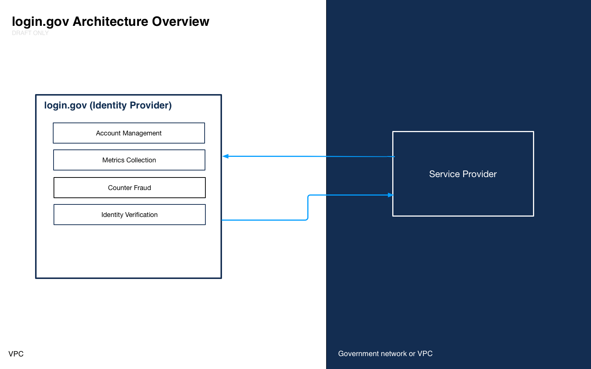
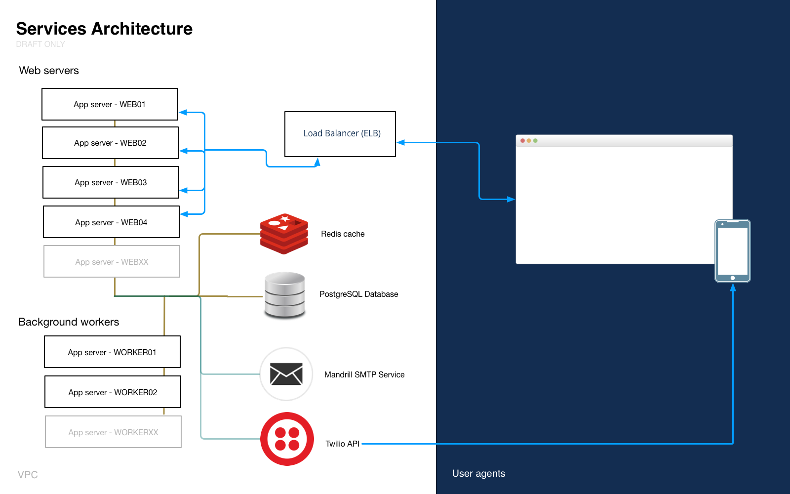
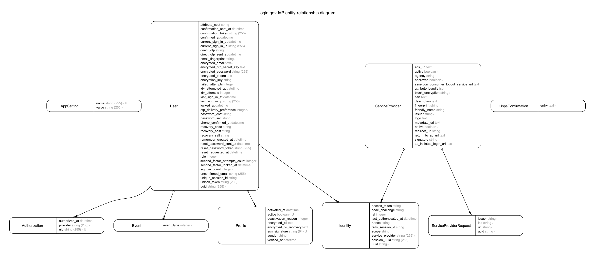

## Architecture

### High-level overview

The current service-level architecture is comprised of Service Providers, the Government Identity Provider (login.gov), and the ability to verify identity within login.gov using various back-end systems (credit authorities, document verifications services, etc.) or delegate authentication to external Identity Providers.

* The current counter fraud components are related to prevention of bad requests and activities with automated reporting.

For more details on our system security, see [SECURITY.md](SECURITY.md).

#### Application architecture

#### Entity-relationship Diagram

### SAML Profile
[Web SSO Profile](SAML_PROFILE.md)

### Routes

Run `bundle exec rake routes` to see the routes.
