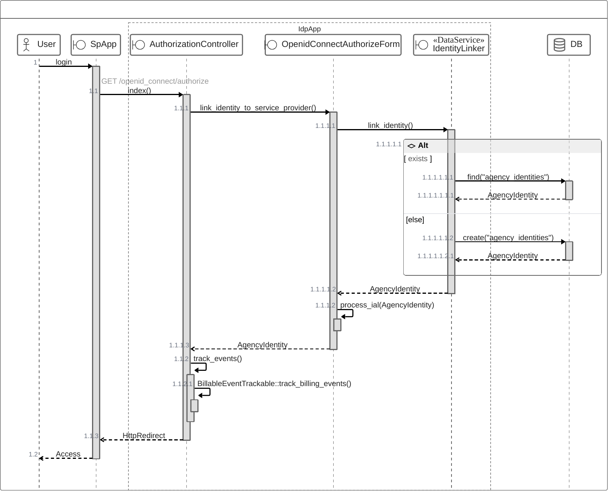

# OIDC Request Flows

```mermaid
---
title: Authorization Flow
---
zenuml
    @Actor User
    @Boundary SpApp

    group IdpApp {
        @Boundary AuthorizationController
        @Boundary OpenidConnectAuthorizeForm
        @Boundary <<DataService>> IdentityLinker
    }
    @Database DB

    @Starter(User)
    Access = SpApp.login {
        //  `GET /openid_connect/authorize`
        HttpRedirect = AuthorizationController.index() {
            AgencyIdentity = OpenidConnectAuthorizeForm.link_identity_to_service_provider() {
            
            AgencyIdentity = IdentityLinker.link_identity() {
                if (exists) {
                AgencyIdentity = DB.find("agency_identities")
                } else {
                AgencyIdentity = DB.create("agency_identities") 
                }
            }
            process_ial(AgencyIdentity) 
            
        }
        SpReturnLog = track_events() {
            SpReturnLog = "BillableEventTrackable::track_billing_events()"
        }
    }

    }
```