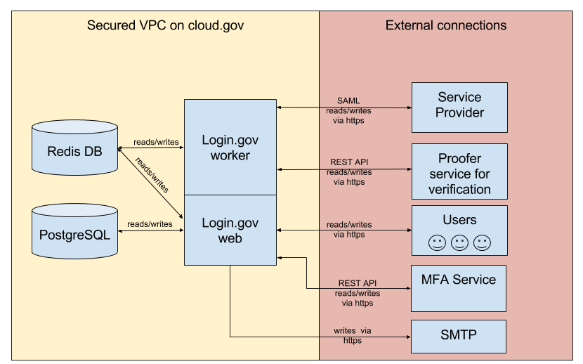

# General System Description

## System Function or Purpose
Login.gov is 18F’s product line for the tools, tech, and services 18F provides to help teams delivering federal digital services to operate efficiently at-scale in a cloud-hosted environment, while complying with federal regulatory requirements. It’s based on and built using the open source ruby based identity-idp project, which is an open platform as a service, providing a choice of developer frameworks, and application services which makes it faster and easier to build, test, deploy, and scale applications. Login.Gov is a self-contained platform as a service (IdaaS) which can be used on top of underlying infrastructures such as Cloud Foundry AWS, VMware and Open Stack.

## Information System Components and Boundaries
18F has created a specific set of VPCs (Live production, tooling, and staging) for Cloud.Gov.  All VPCs have subnets used to separate and control IP address space within each individual VPC. Subnets must be created in order to launch Availability Zone (AZ) specific services within a VPC. 18F has setup VPC Peering between the Staging VPC, tooling VPC and the CF Live production VPC.

Login.gov components include a self-service application execution engine, an automation engine for application deployment and lifecycle management, and a scriptable command line interface (CLI), as well as integration with development tools to ease deployment processes. It has an open architecture that includes a buildpack mechanism for adding frameworks, and application services interface, and a cloud provider interface.

The Login.Gov IdaaS Information System is hosted within Cloud.Gov running on AWS East Public Cloud in the Northern Virginia Region. AWS services utilized include ENI, EC2, EBS, VPC, RDS, S3, MFA, Route 53, ELB and IAM. These are listed as leveraged hardware, network and server components.

Physical aspects of the Login.Gov IdaaS information system are outside of the authorization boundary due to all hardware being physically managed by AWS. While other services are reviewed and approved for use by the GSA OCISO, they were deemed to be ancillary support services that do not directly process/store data but rather provide general support services. These services include Cloudwatch, CloudFormation, AWS Config and Trusted Advisor.

The authorization boundary diagram represented depicts the core components which make up the System in its entirety.  Login.gov resides within Cloud.gov. While Cloud.gov is outside the boundary, it belongs to an authorized System thus allowing for inheritance of the component. Other support services outside the Login.Gov information system authorization boundary include Twilio, New Relic, SMPT service, MFA service, Experian, and Federal Information Technology systems.

## Network Architecture
The following architectural diagram(s) provides a visual depiction of the system network components that constitute Login.gov.

Login.gov service architecture: 

Login.gov Admin infrastructure: 

## Login.Gov Security Domain Stack
### Identification and Authentication Control

18F staff utilizes multi-factor authentication (MFA) for AWS IAM, GitHub, Trello and Slack. Access to these services requires multi-factor authentication using both the login and the MFA device. When a user signs into these services, they are prompted for an authentication code from their MFA device.  Once the user has entered their username and password along with their authentication code, they will then be granted access. Slack, GitHub and Trello use authentication codes delivered to users’ cell phones generated by an application such as Google authenticator or sent as a text message (SMS). Trello also performs pass-thru authentication by using google authenticator or GSA’s SecureAuth and a GSA email account of the user.

AWS Identity and Access management (IAM) is used to manage 18F users and their privileges that use the virtual private cloud environment. Each user is assigned a specific role or multiple roles within IAM to ensure they are only allowed authorized privileges and functions required to perform their job.  All access to IAM requires multi-factor authentication through AWS MFA. 18F staff uses a mobile application such as google authenticator to receive randomly generated authorization codes to access the AWS management console and services.

Login.gov is administered by designated 18F DevOps staff members who require access to the underlying Cloud.Gov platform login to the Cloud.Gov jump box using SSH credentials. MFA functionality for the Cloud.gov jump box is on 18F’s roadmap to implement for privileged access. The jumpbox is a virtual machine (VM) that acts as an access point for the deployed VMs. Direct access to other Login.gov VMs is disabled. The jumpbox is located in the us-east-1d Availability zone. Privileged access to the jumpbox is restricted to originate only from GSA IP space and a limited set of IPs that 18F DevOps use to access from the office.

### ACLs, Software defined Firewalls and Security Groups

Login.gov AWS IaaS as the underlying control domain that provides a layer of protection to enhance each boundary, both external and internal.  The VPC is configured to utilize routing tables, network access control lists, subnet rules, and security group (firewall) rules.  Each of these controls must have appropriate rules and routes in-place before any external service is able to reach a host within Cloud.Gov.

Amazon S3 Access Control Lists (ACLs) enable 18F to manage access to buckets and objects. Each bucket and object has an ACL attached to it as a sub-resource. It defines which AWS accounts or groups are granted access and the type of access. When a request is received against a resource, Amazon S3 checks the corresponding ACL to verify the requester has the necessary access permissions. When a bucket or an object is created, Amazon S3 creates a default ACL that grants the resource owner full control over the resource.  A grantee can be an AWS account or one of the predefined Amazon S3 groups.

Each Login.gov EC2 instance or group of instances is assigned to at least one Security Group with specific assigned roles. These roles delineate what traffic is allowed inbound & outbound for each instance by allowing or denying ports, protocols, and services. Access controls within EC2 include, secure login to instances using key pairs and username, a firewall that enables the specification of ports, protocols and source IP ranges that can reach instances.

The Login.Gov platform is secured using VPC F/Wed routing rules.

### Audit Logging, Monitoring and intrusion detection

Login.gov depends on AWS for CloudWatch, AWS Elasticsearch managed services, and Kinesis for centralized audit logging and monitoring of Login.gov components, applications, and data APIs. The logs captured from the Auditing tool set can be used in forensic analysis to track down the time of intrusion, as well as the method used to penetrate into the network. It’s used in a way to monitor attacker activities in the network and help determine the reason behind an attack.

The Auditing tool set includes CloudWatch, a centralized logging and parsing data pipeline that is used to process logs in different formats. It uses different rules to format each log message into multiple fields, which are indexed by the Elasticsearch search engine used for deep searches and data analytics.  Kinesis is a web interface that provides an overview of the collected data, so 18F can easily view and analyze the collected logs.

18F has implemented CloudWatch for its resource monitoring. It allows 18F to monitor AWS resources in near real-time, including Amazon EC2 instances, Amazon EBS volumes, Elastic Load Balancers, and Amazon RDS DB instances. Metrics such as CPU utilization, latency, and request counts are provided automatically for these AWS resources. It allows 18F to supply logs or custom application and system metrics, such as memory usage, transaction volumes, or error rates.  All VPC Flow logs, CloudWatch and CloudTrail data in relation to Cloud.Gov are consumed by the ELK stack and visualized through a Grafana dashboard.

### Vulnerability Scanning, Penetration testing

18F utilizes ?OpenVAS? for vulnerability scanning and asset management of its network environment. 18F conducts baseline configurations scans, compliance scans, virtual infrastructure and network scans using custom scan policies and templates. The Nessus manager is located in a separate VPC, which is a peer of Login.gov live VPC. Public access to the Nessus Manager is limited within the GSA IP address only. It runs both authenticated/unauthenticated scans against 18F assets and provides reporting and grouping functions of vulnerabilities with scanned assets. OpenVAS allows 18F to track risk level changes based on remediation efforts and provides a variety of scan report outputs. OpenVAS reports 18F assets vulnerable to common exploits. Metasploit is a penetration testing platform designed to exploit and validate vulnerabilities found within 18F’s virtual private cloud and applications.

18F utilizes OWASP ZAP for internal web application scanning of information systems and components. It is used to scan for the OWASP Top 10 vulnerabilities within applications and it can perform enhanced automated penetration testing functions.   

### Cloud Inventory and Asset Management

18F utilizes VisualOps Cloud management to provide a visual, real-time representation of 18F’s virtual cloud infrastructure. It also provides a global view of the 18F AWS account where all regions and services can be seen in one place.  Visual Ops has a WYSIWYG editor to design, configure and provision AWS cloud applications. Once applications are deployed, VisualOps monitors and manages the apps to ensure they are running in the defined states.                   

AWS Config can export a complete inventory of AWS resources with all configuration details, determine how a resource was configured at any point in time, and get notified via Amazon SNS when the configuration of a resource changes. AWS Config can provide configuration snapshots, which is a point-in-time capture of all 18F resources and their configurations. Configuration snapshots are generated on demand via the AWS CLI, or API, and delivered to an Amazon S3 bucket that is specified.

18F uses Cloudability for AWS cost and usage management of the AWS virtual infrastructure. It provides graphical information of detailed billing of the AWS account information through analytics on usage and consumption across 18F’s AWS account.

### Static and Dynamic Code Analysis

Code Analysis for Login.Gov is performed by Code Climate which is integrated by Cloud Foundry in GitHub to perform all static code analysis for the platform. Code Climate is an automated static code analysis for the platform as a service that is Cloud.Gov. It integrates directly into 18F's continuous integration (CI) workflow and provides notifications of actionable findings in GitHub, and Slack when an issue arises. 18F uses a variety of other analyzers based on the type of codebase used on top of the platform. OWASP Zap is used as an dynamic code analysis tool. It has the capability to dynamically probe web applications looking for unknown vulnerabilities found in the source code.   

### Incident Response Resolution and Communication

18F utilizes PagerDuty for Incident response and communication. It integrates with 18Fs entire monitoring and deployment stack which includes Slack, Cloudwatch, New Relic and Auditing service with real-time alerts and visibility into critical systems and applications. It allows the DevOps team to quickly detect, triage, and resolve incidents from development through production.

The SecOps team can view centralized alerts from Auditing stack for 18F’s visibility of the entire application stack and virtual infrastructure which enables the team to prioritize, escalate and execute the incident response process.

### Configuration Management and Version Control

18F’s configuration management process consists of GitHub. Baselines and configuration files are stored in GitHub repositories using version control. These files are then deployed using a pipeline yaml file with  Travis, continuous integration platform.

# System Environment
The following describes the Login.Gov Identity Platform as a Service (IdPaaS) as deployed in production based on the network diagrams. It is implemented as hardened EC2 instances or virtual servers operating within Login.gov Virtual Private Cloud (VPC).  The instances are deployed to grow and shrink based on demand.

To provide high availability, Login.gov's blob store is on AWS S3, and the backend DB on AWS. The DB resource is allocated from AWS Relational Database Service (RDS). _The backups of the database are configured with a Retention Point Objective (RPO) within the last five minutes._

Login.Gov is a system with multiple components. All traffic through AWS elastic load balancer (ELB).

A load-balancing router sits at the front of login.gov to route incoming requests to the correct application.  The only access points visible on a public network are a load balancer that maps to one or more Login.gov routers and, optionally, a NAT VM and a Bastion Host (Jumpbox).
\
### Logingov Virtual Private Cloud (VPC) environment

#### Public Subnet
The hosts within the Public subnet are only used for system maintenance and DNS purposes only.  Instances do not contain any GSA operational data.  The Public subnet allows only the necessary inbound and outbound access with the Internet defined by AWS Security Groups.  In the public subnet there exists a Cloud Foundry bastion host (jump box), A VM that acts as a single access point for the deployed instances as disabling direct access to the instances is a common security measure.  The bastion host (Jumpbox) is used for the purpose of managing the infrastructure.

#### Private Subnet - Core Tier
The Core Tier is a production subnet where the Login.gov instances reside.   Access to this subnet is restricted to only administrators.  All application development, maintenance and deployment are conducted within the Core Tier subnet.

#### Private Subnet - Database Tier
The Database Tier hosts the Cloud.Gov configurations within a PostgreSQL database (i.e. users, orgs, and spaces). These are hosted in geographically separated, isolated by failure physical locations; in short the RDS database is in a Multi-AZ deployment.

#### Private Subnet - Metrics
The Metrics subnet includes Login.gov’s continuous integration continuous deployment (CI/CD) pipeline. Baseline and configuration files are stored in GitHub repositories using version control. These files are then deployed using a pipeline yaml file within the Concourse continuous integration platform. It also hosts the Audit service logging and collection tools used for Login.gov.

#### User Accounts
All users have their employee status categorized with a sensitivity level in accordance with PS-2. Employees (or contractors) of service providers are considered Internal Users. All other users are considered External Users. User privileges (authorization permission after authentication takes place) are described in the table that follows.  At this time all users who have access to the 18F AWS VPC and the underlying Login.gov are internal users. There is no external access granted to users outside of the 18F/USDS programs and GSA.

## Types of Users
| Role            | Internal or External | Sensitivity Level | Authorized Privileges and Functions Performed                                                                                                                                                                                                                                                                                                                                                                                                                                               |
|-----------------|----------------------|-------------------|---------------------------------------------------------------------------------------------------------------------------------------------------------------------------------------------------------------------------------------------------------------------------------------------------------------------------------------------------------------------------------------------------------------------------------------------------------------------------------------------|
| administrators     | Internal             | High              | AWS IAM RBAC with MFA access to AWS AMI and VPC rules                                                                                                                                                                                                     

## Hardware Inventory

None - Leveraged from AWS Infrastructure|
-|

## Software Inventory
| Hostname                              | Function                                                                                                                                                                                                                                             | Version   | Patch Level | Virtual (Yes / No) |
|---------------------------------------|------------------------------------------------------------------------------------------------------------------------------------------------------------------------------------------------------------------------------------------------------|-----------|-------------|--------------------|
| Login.gov Server                          | Handles authentication for general users and delegates all other identity management tasks to the SP.| Version 1 |         | Yes                |
| JumpBox                              | Used to run AWS AMI management                                                                                                                                                                                                                            | Version 1 |          | Yes                |

| Audit services                           | Front end for consuming logging and monitoring data for metrics reporting                                                                                                                                                                                                                               | Version 1 |          | Yes                |
| Concourse CI                               | Performs continuous deployment and integration of Login.gov components                                                                                                                                                                                                               | Version 0.75| 0.75         | Yes                |
| Code Climate | CloudFoundry Static code analysis tool for the source code| Latest Version| NA| Yes|
|GitHub| Login.gov code repository and version control| Latest Version| NA | Yes|
|Login.gov AMI| operating system used in deployed EC2 instances for Login.gov| Ubuntu 12.04 LTS| 12| Yes|

The following table lists all other applications and components used in relation to the Cloud.Gov PaaS information system.

|Component Name| Function| Version| Patch Level| Virtual|
|--------------|---------|--------|------------|--------|
|OpenVAS| Vulnerability scanner for the Login.gov platform| Latest Version |NA|Yes|
|New Relic| Application and performance metrics for Cloud.Gov| Latest Version|NA| Yes|
|Cloudability| Monitor, optimize and govern Cloud Costs related to the AWS Infrastructure| Latest Version |NA| Yes|
|Slack| Message, alert and communications app | Latest Version | NA |Yes|
|Trello| Used for agile, scrum and story boarding| Latest Version | NA | Yes|
|Pager Duty| Incident communication platform used by DevOps| Latest Version|

## Network Inventory
None - Leveraged from AWS Infrastructure|
-|

## Ports, Protocols and Services
| Ports (T or U) | Protocols | Services                                     | Purpose                                                                                                                                     | Used By                                |
|----------------|-----------|----------------------------------------------|---------------------------------------------------------------------------------------------------------------------------------------------|----------------------------------------|
| 443 (T)        | HTTPS     | HTTPS                                        | LG ec2 web service                                                                                                                          | AWS                     |
| 2222 (T)       | SSH       | Secure Shell deamon (SSH)                    | External port for SSH access for apps                                                                                                       | SSH Jumpbox                        |
                |

## System Interconnections
None - Not Applicable|
-|
